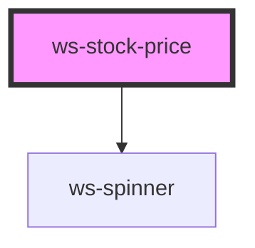

# ws-stock-price

<!-- Auto Generated Below -->

## Properties

| Property      | Attribute      | Description | Type     | Default     |
| ------------- | -------------- | ----------- | -------- | ----------- |
| `stockSymbol` | `stock-symbol` |             | `string` | `undefined` |

## Dependencies

### Depends on

- [ws-spinner](../spinner)

### Graph

----------------------------------------------

*Built with [StencilJS](https://stenciljs.com/)*
